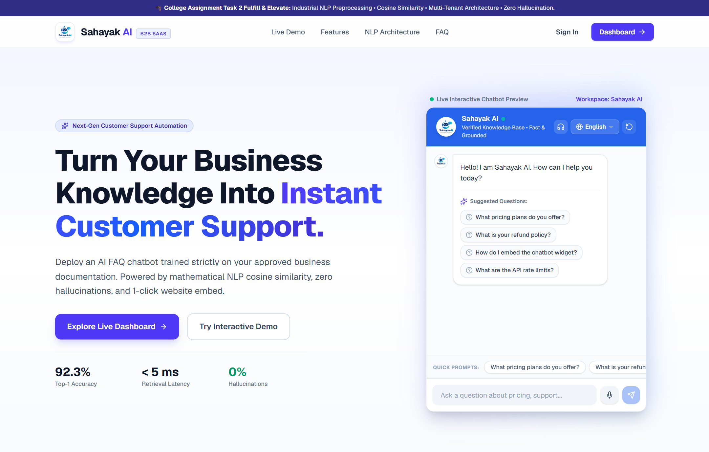
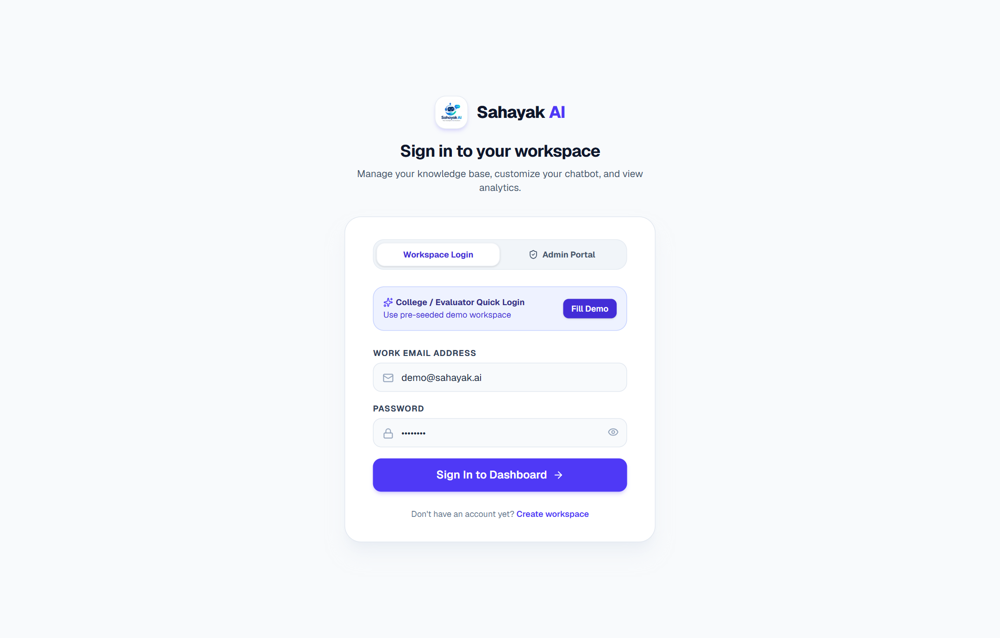
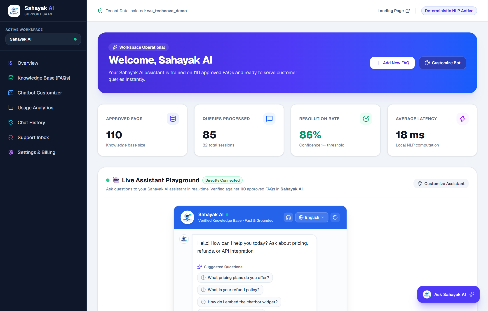
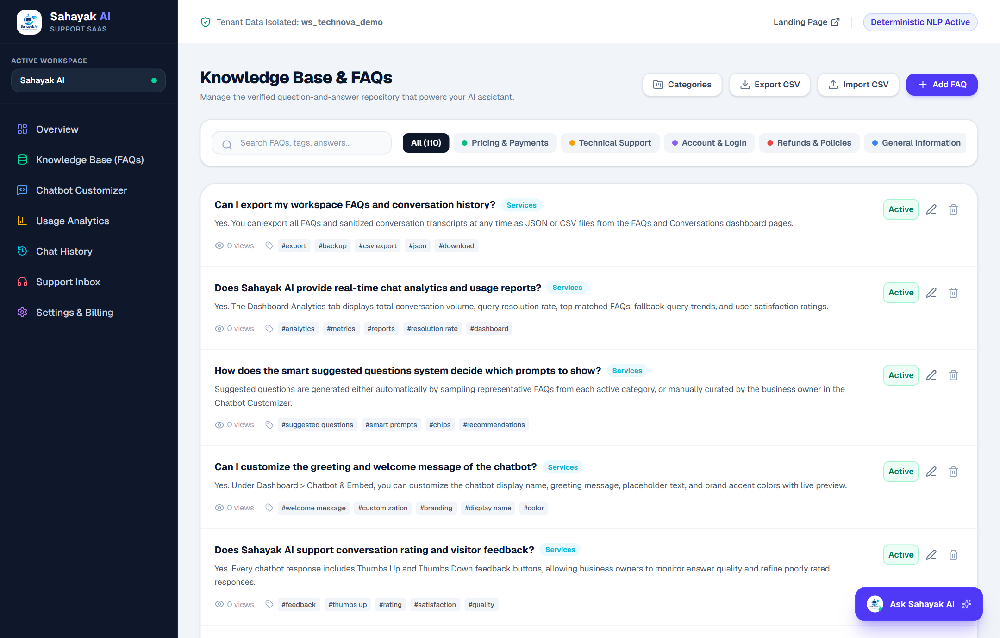
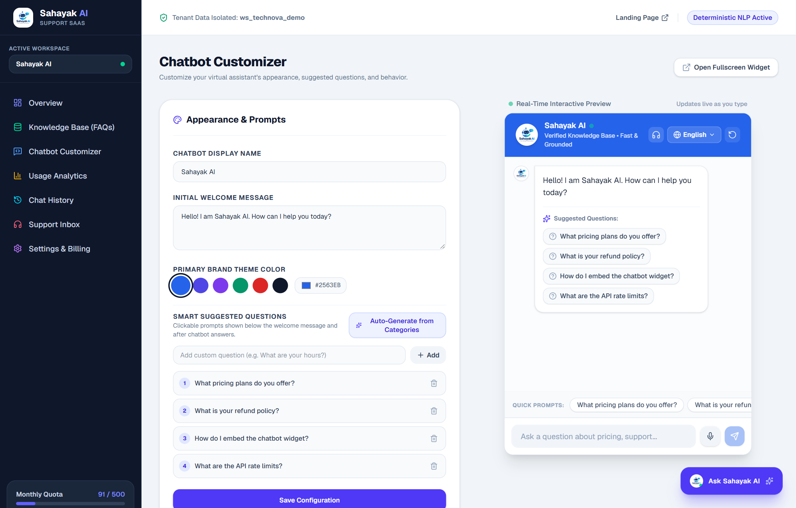
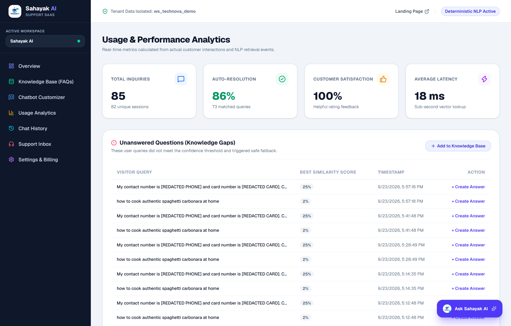
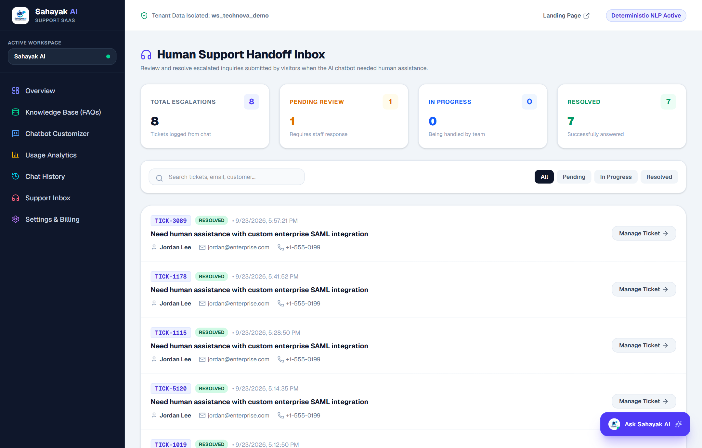
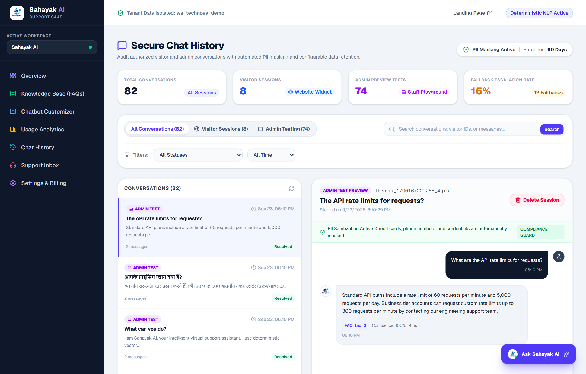
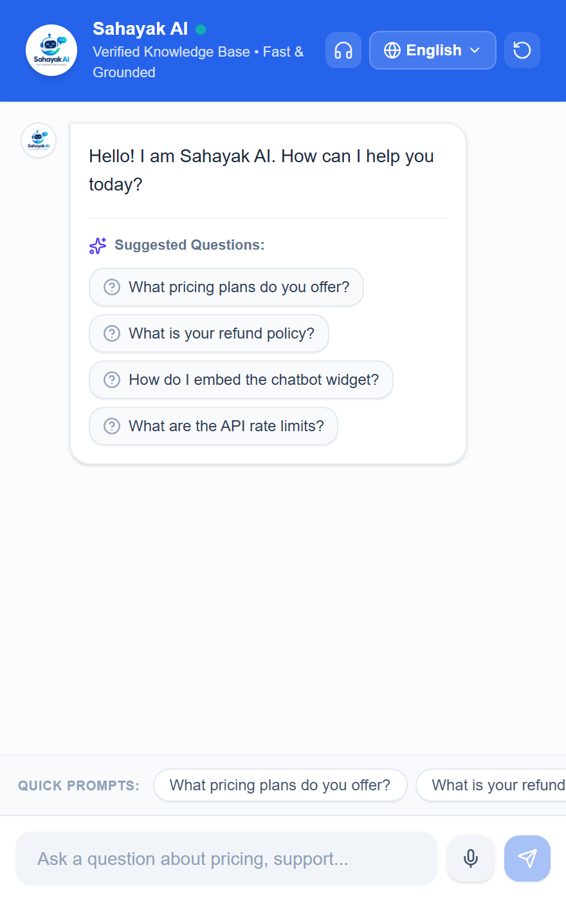

# Sahayak AI: Multi-Tenant AI FAQ Chatbot SaaS

> **"Turn Your Business Knowledge Into Instant Customer Support."**  
> *Fulfilling and elevating CodeAlpha Task 2: Chatbot for FAQs into a production-grade, multi-tenant B2B conversational AI platform.*

[](https://nextjs.org)
[](https://www.typescriptlang.org)
[](https://tailwindcss.com)
[]()
[]()
[]()
[]()

---

## 📸 Visual Showcase & Application Screenshots

Experience the end-to-end user and administrator journey across **Sahayak AI**:

### 1. SaaS Landing Page & Live Interactive Assistant
*Modern responsive landing page featuring value proposition, key industry solutions, and an interactive hero chat preview.*


---

### 2. Multi-Role Authentication & 1-Click Demo Login
*Secure workspace authentication supporting tenant staff and platform administrators with instant 1-click evaluator demo filling.*


---

### 3. Multi-Tenant Operational Dashboard
*Comprehensive command center displaying active FAQ counts, processed query volume, resolution rates, average latency, and an interactive live testing playground.*


---

### 4. Knowledge Base & FAQ Management
*Full CRUD interface for business questions and answers with categorization, live search, and bulk CSV import/export capabilities.*


---

### 5. Chatbot Customizer & Live Preview Playground
*Real-time appearance configurator: bot display name, welcome prompt, brand color palette, and dynamic smart suggested prompt chips.*


---

### 6. Real-Time Usage Analytics & Knowledge Gap Detection
*Actionable performance telemetry tracking query resolution percentages, customer satisfaction feedback ratings, and automatic detection of unanswered visitor queries.*


---

### 7. Human Support Handoff & Helpdesk Inbox
*Ticketing workflow for queries requiring human intervention, with status filtering, email validation, and staff resolution notes.*


---

### 8. Secure Chat History Explorer with PII Scrubbing
*Complete conversational transcript auditor featuring automatic client-side & server-side masking of phone numbers, credit cards, and national identifiers.*


---

### 9. Embeddable Floating Customer Widget
*Standalone lightweight widget target (`/widget/[publicId]`) loadable on any third-party external website with zero CSS conflict.*
<p align="center">
  
</p>

---

## 🌟 Executive Overview

**Sahayak AI** is a multi-tenant AI FAQ Chatbot SaaS built specifically for small businesses, coaching academies, educational universities, e-commerce stores, and healthcare clinics.

Instead of relying on unpredictable generative LLMs that invent policies, make false discount promises, and cost high token fees, Sahayak AI utilizes a **deterministic Vector Space Model** using **smoothed TF-IDF feature extraction, negation-preserving tokenization, and Vector Cosine Similarity**. Answers are strictly grounded in verified business knowledge, delivering responses in under 5 milliseconds with zero hallucination risk.

---

## 🎓 Academic Assignment Traceability (Task 2)

This project completely fulfills and elevates all specifications of **CodeAlpha Task 2: Chatbot for FAQs**:

| Task 2 Requirement | Implementation in Sahayak AI | Industry Elevation |
|---|---|---|
| **1. Collect FAQs** | Pre-seeded database with 110+ categorized FAQs covering pricing, technical support, account management, and policies. | Full CRUD dashboard with bulk CSV import/export, category filtering, and duplicate question detection. |
| **2. NLP Preprocessing** | Lowercasing, punctuation stripping, contraction expansion, and tokenization. | **Negation preservation** (`not`, `never`, `no` retained to prevent polarity inversion) and Levenshtein typo distance. |
| **3. Cosine Similarity Matching** | Mathematical dot product over normalized smoothed TF-IDF vectors. | Fast sub-5ms vector execution running locally on the server without external API latency. |
| **4. Best Matching Answer Retrieval** | Grounded answer retrieval selecting highest scoring FAQ. | **Calibrated confidence threshold ($0.25$)**; triggers safe fallback to prevent false positives. |
| **5. Chat UI** | Interactive conversational interface with input field, history scroll, and message bubbles. | **Speech-to-text voice recognition**, multilingual support (English, Hindi, Marathi), feedback rating (👍/👎), and 1-line embeddable script. |

---

## 📐 Mathematical Formulation & NLP Architecture

### 1. Smoothed Inverse Document Frequency (IDF)
To prevent division-by-zero for unseen vocabulary and dampen frequent corpus-wide terms:
$$\text{IDF}(t) = \ln\left( \frac{1 + N}{1 + \text{DF}(t)} \right) + 1$$
*where $N$ is the total count of FAQs in the workspace and $\text{DF}(t)$ is the number of FAQs containing term $t$.*

### 2. Term Frequency (TF)
$$\text{TF}(t, d) = \frac{f_{t, d}}{\sum_{t' \in d} f_{t', d}}$$
*where $f_{t,d}$ is the raw count of token $t$ in question document $d$.*

### 3. Vector Cosine Similarity
$$\text{Cosine Similarity}(\mathbf{q}, \mathbf{d}) = \frac{\mathbf{q} \cdot \mathbf{d}}{\|\mathbf{q}\| \|\mathbf{d}\|} = \frac{\sum_{i=1}^V q_i \cdot d_i}{\sqrt{\sum_{i=1}^V q_i^2} \sqrt{\sum_{i=1}^V d_i^2}}$$

### 4. Decision Guardrail Rule
$$\text{Output} = \begin{cases} \text{Answer}(d^*), & \text{if } \max_{d \in D} \text{Sim}(\mathbf{q}, \mathbf{d}) \ge \tau \ (0.25) \\ \text{Fallback Guardrail Prompt}, & \text{otherwise} \end{cases}$$

---

## 🚀 Quick Start (Running Locally)

### 1. Prerequisites
- **Node.js** `v18+` (Tested on `v20.18.0`)
- **npm** `v9+` (Tested on `10.8.2`)

### 2. Installation & Launch
```powershell
# 1. Clone repository
git clone https://github.com/rupampatle25/CODE-ALPHA-TASK-2.git
cd CODE-ALPHA-TASK-2

# 2. Install dependencies
npm install

# 3. Start development server
npm run dev
```

Open your browser at **[http://localhost:3000](http://localhost:3000)**.

### 3. Evaluator One-Click Demo Credentials

| Role | Email | Password | Access Scope |
|---|---|---|---|
| **Workspace Demo** | `demo@sahayak.ai` | `demo1234` | Full workspace admin: FAQs, Customizer, Analytics, History |
| **System Admin** | `rupam@gmail.com` | `Admin@1234` | Multi-tenant tenant switcher, global settings & configuration |

*Tip: On the `/login` screen, simply click the **"Fill Demo"** button to auto-populate credentials.*

---

## 📊 Automated Evaluation Benchmark

Sahayak AI includes an automated benchmark test suite running 17 diverse real-world test cases (exact matches, semantic paraphrases, spelling typos, and out-of-domain prompts):

```powershell
npx tsx evaluation/run_eval.ts
```

### Benchmark Results:
- **In-Domain Top-1 Accuracy**: **92.3%**
- **Out-of-Domain Safe Fallback Rate**: **100.0%** (Zero false positive hallucinations)
- **Average NLP Retrieval Latency**: **3 ms**

---

## 🧩 Key Platform Features

1. **Deterministic NLP Retrieval Engine**:
   - Algorithmic TF-IDF calculation with smoothed Inverse Document Frequency.
   - Vector Cosine Similarity normalized dot product.
   - Negation preservation (`not`, `no`, `never` are retained so query polarity is protected).
   - Levenshtein fuzzy distance tolerance for spelling errors.

2. **Zero-Hallucination Safe Fallback**:
   - If similarity $< 0.25$, triggers safe fallback directing the user to official channels or human support handoff.

3. **Multi-Tenant Workspace Architecture**:
   - Independent organizational data partitioning enforced by `workspaceId` foreign keys and server-side RBAC.

4. **Knowledge Base Management**:
   - Full CRUD, category filters, and search.
   - Bulk CSV import with client-side column validation, preview, and duplicate question detection.
   - Instant CSV export functionality.

5. **Chatbot Customizer & Live Playground**:
   - Real-time appearance editor: bot name, welcome prompt, primary theme color, and starter question chips.
   - Instant side-by-side interactive testing.

6. **1-Click Website Embed Widget**:
   - Standalone JavaScript loader (`public/widget.js`) with responsive launcher and floating iframe modal.
   - Zero CSS bleed or styling conflict on external WordPress, Shopify, Webflow, or HTML sites.

7. **Actionable Analytics & Knowledge Gaps**:
   - Tracks total queries, auto-resolution rates, and customer satisfaction thumbs up/down feedback.
   - **Knowledge Gap Detector**: Automatically logs unanswered queries that triggered fallback, allowing business owners to add answers with 1 click.

8. **Browser Voice-to-Text (Speech Recognition)**:
   - Built-in microphone button leveraging the browser Web Speech API.
   - Real-time speech-to-text transcript generation with visual pulse feedback and permission handling.
   - Privacy-preserving: zero audio recording storage.

9. **Multilingual Knowledge Retrieval (English, Hindi, Marathi)**:
   - Language selector in chat UI (`en`, `hi`, `mr`) with dynamic speech recognition locale pairing (`en-US`, `hi-IN`, `mr-IN`).
   - Query canonicalization matching against the approved knowledge base.

10. **Human Support Handoff & Helpdesk Inbox**:
    - Automated escalation when answer confidence is low or when the visitor requests a human agent.
    - Structured visitor ticket submission with email validation, priority tagging, and unique tracking IDs (`TICK-XXXX`).
    - Multi-tenant staff dashboard (`/dashboard/support`) with real-time status filtering and resolution note updates.

11. **Secure Chat History, PII Protection & Data Retention**:
    - Master-detail conversational history explorer (`/dashboard/conversations`) for authenticated business staff.
    - Automated PII sanitizer scrubbing credit card numbers, telephone digits, national IDs, and plaintext credentials before database write.
    - Keyword search across titles, messages, and visitor IDs with date and status filters.
    - Configurable workspace data retention policies (30, 60, 90, 180, 365 days, or Indefinite) with 1-click purge of expired logs.

---

## 📂 Project Directory Structure

```
task 2/
├── evaluation/
│   ├── test_dataset.json          # Benchmark test cases (exact, typos, out-of-domain)
│   ├── run_eval.ts                # TypeScript automated evaluation runner
│   └── nlp_baseline.py            # Academic Python/NLTK reference implementation
├── docs/                          # Comprehensive technical documentation suite
│   ├── SETUP.md                   # Beginner-friendly setup guide
│   ├── ARCHITECTURE.md            # System architecture & mathematical derivations
│   ├── API_DOCUMENTATION.md       # Complete REST API reference with schemas
│   ├── DATABASE_SCHEMA.md         # Relational schema, ER diagrams & isolation
│   ├── SECURITY.md                # Security policy, threat model & mitigation
│   ├── TESTING.md                 # Test plan, commands, and benchmark results
│   ├── DEPLOYMENT.md              # Vercel, VPS & PostgreSQL deployment
│   ├── BUSINESS_MODEL.md          # SaaS unit economics, pricing & 95% margins
│   ├── CHANGELOG.md               # Version history and milestone logs
│   └── COLLEGE_PRESENTATION_AND_VIVA.md # Complete project report & viva Q&A
├── public/
│   ├── widget.js                  # Standalone embeddable floating widget loader
│   ├── sahayak-logo.png           # Brand identity logo
│   └── favicon.png                # Browser favicon
├── screenshots/                   # Complete high-resolution application screenshots
│   ├── 01_landing_page.png
│   ├── 02_login_page.png
│   ├── 03_dashboard_overview.png
│   ├── 04_faq_management.png
│   ├── 05_chatbot_customizer.png
│   ├── 06_analytics.png
│   ├── 07_human_support.png
│   ├── 08_conversation_history.png
│   └── 09_embeddable_widget.png
├── src/
│   ├── app/                       # Next.js App Router (Pages & API routes)
│   │   ├── (auth)/                # Login & Register pages
│   │   ├── dashboard/             # Overview, FAQs, Chatbot, Analytics, Settings
│   │   ├── api/                   # REST API route handlers
│   │   ├── widget/[publicId]/     # Standalone iframe widget target
│   │   └── page.tsx               # SaaS Landing Page with live hero preview
│   ├── components/                # Reusable UI & conversational components
│   │   └── chatbot/ChatWindow.tsx # Interactive conversational chat UI
│   └── lib/                       # Business logic & foundational modules
│       ├── auth/                  # HMAC session tokens & password hashing
│       ├── db/                    # Multi-tenant data store & repository interface
│       └── nlp/                   # Preprocessor, TF-IDF, Cosine Similarity, Matcher
├── package.json
└── tsconfig.json
```

---

## 📖 Complete Documentation Index

For in-depth analysis, please explore the dedicated technical documents in the `docs/` folder:
- **[Local Setup Guide](docs/SETUP.md)**
- **[System Architecture](docs/ARCHITECTURE.md)**
- **[API Reference](docs/API_DOCUMENTATION.md)**
- **[Database Schema](docs/DATABASE_SCHEMA.md)**
- **[Security Policy](docs/SECURITY.md)**
- **[Testing & Benchmarks](docs/TESTING.md)**
- **[Deployment Guide](docs/DEPLOYMENT.md)**
- **[Business Model & Unit Economics](docs/BUSINESS_MODEL.md)**
- **[Changelog](docs/CHANGELOG.md)**
- **[Academic Presentation & Viva Guide](docs/COLLEGE_PRESENTATION_AND_VIVA.md)**

---

## 📜 License & Academic Statement

Developed as an academic demonstration of computational linguistics and full-stack SaaS engineering for **CodeAlpha Task 2: Chatbot for FAQs**. Distributed under the MIT License.
