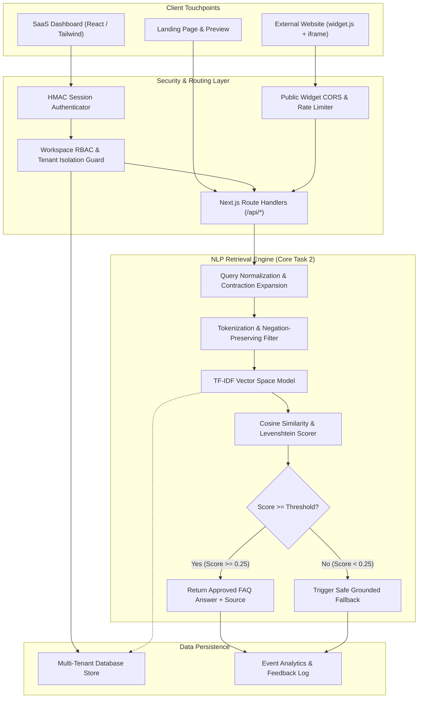
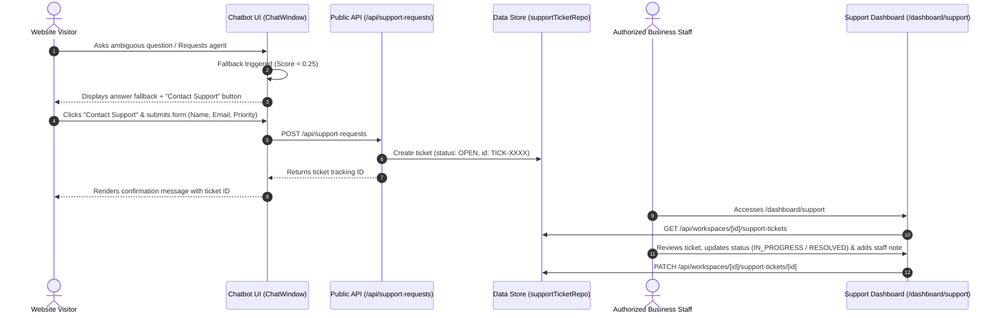
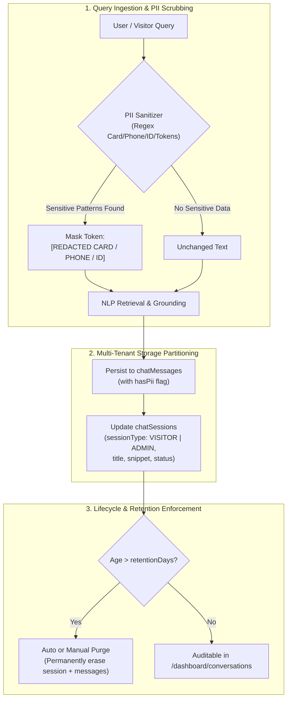

# FAQPilot AI: System Architecture & Technical Specification

This document details the high-level architecture, subsystem boundaries, data flows, and mathematical algorithms underpinning **FAQPilot AI**.

---

## 1. High-Level Architectural Diagram

---

## 2. The Core NLP Retrieval Pipeline

The NLP retrieval engine fulfills the college assignment requirements through a deterministic, transparent pipeline that avoids LLM hallucinations.

### Step 1: Text Cleaning & Normalization
- **Contraction Expansion**: Normalizes abbreviations (`can't` $\to$ `cannot`, `i'm` $\to$ `i am`).
- **Symbol Stripping**: Removes non-alphanumeric noise while preserving single spaces.
- **Case Folding**: Converts all text to lowercase.

### Step 2: Smart Tokenization & Negation Preservation
Standard NLP implementations remove all stopwords indiscriminately. In customer support, naive stopword removal destroys query polarity:
- *Query*: *"Why is my refund not processed?"*
- *Naive Stopwords*: *"refund processed"* $\implies$ completely reverses intent!

**Innovation**: FAQPilot AI uses a curated stopword set that **strictly retains negation words** (`not`, `no`, `never`, `cannot`, `without`, `none`).

### Step 3: TF-IDF Vector Space Model
Each document $d$ and query $q$ is converted into an $n$-dimensional real-valued vector:

$$\text{TF}(t, d) = \frac{\text{count}(t, d)}{|d|}$$

$$\text{IDF}(t) = \ln\left(\frac{1 + N}{1 + \text{df}(t)}\right) + 1$$

$$\vec{v}[t] = \text{TF}(t, d) \times \text{IDF}(t)$$

### Step 4: Vector Cosine Similarity
Calculates the angular difference between user query vector $\vec{u}$ and candidate FAQ vector $\vec{v}$:

$$\text{CosineSimilarity}(\vec{u}, \vec{v}) = \frac{\vec{u} \cdot \vec{v}}{\|\vec{u}\|_2 \|\vec{v}\|_2} = \frac{\sum_{i=1}^n u_i v_i}{\sqrt{\sum_{i=1}^n u_i^2} \sqrt{\sum_{i=1}^n v_i^2}}$$

### Step 5: Multi-Signal Composite Scoring
To tolerate user typos and short queries, FAQPilot AI computes a composite score:

$$\text{Score} = 0.60 \times \text{Cosine}(\vec{u}, \vec{v}) + 0.20 \times \text{Jaccard}(u, v) + 0.20 \times \text{Fuzzy}(u, v)$$

Where $\text{Fuzzy}$ uses Levenshtein edit distance ($d \le 2$).

### Step 6: Confidence Threshold Guardrail
- If $\text{Score} \ge 0.25$: Return verified FAQ answer with source attribution and latency.
- If $\text{Score} < 0.25$: Trigger the safe fallback:
  > *"I couldn't find a reliable answer in this business's knowledge base. Please contact the business directly or try asking your question another way."*

---

## 3. Multi-Tenant Data Isolation

Tenant isolation is strictly maintained at the software and database layer:
1. Every business organization is given an isolated `Workspace` record.
2. All database entities (`Faq`, `FaqCategory`, `ChatSession`, `ChatMessage`, `WidgetConfig`, `UsageQuota`, `SupportTicket`) contain an indexed `workspaceId` foreign key.
3. Every API endpoint enforces `verifyWorkspaceAccess(userId, workspaceId)`.
4. Tenant data is queried exclusively using `{ workspaceId }` filtering.

---

## 4. Grounded Multilingual Translation Architecture

To ensure high reliability without third-party generative hallucination:
1. **Visitor Language Selection**: Chat UI accepts `en` (English), `hi` (Hindi), and `mr` (Marathi).
2. **Speech Recognition Synchronization**: Setting `recognition.lang = 'hi-IN'` or `'mr-IN'` enables native phonetic input.
3. **Query Canonicalization**: Input queries are normalized and matched against canonical dictionary terms before TF-IDF vectorization.
4. **Answer Grounding**: Only verified answers retrieved from the workspace knowledge base are translated into the target language.

---

## 5. Human Support Handoff & Helpdesk Architecture

### Key Principles:
1. **Zero Hallucinated Human Interaction**: The system never fakes a live response. It acknowledges ticket receipt and informs the visitor when actual staff review will occur.
2. **Multi-Tenant Ticket Partitioning**: All tickets are stored with `workspaceId` and are accessible solely to authenticated business members.
3. **Visitor Privacy Protection**: Forms collect minimal data (optional name, validated email) and clearly communicate data handling.

---

## 6. Secure Chat History, PII Protection & Data Retention Architecture

### Privacy & Compliance Guarantees:
1. **Pre-Persistence Redaction**: Sensitive personal data (credit card numbers, telephone digits, national identifiers, passwords/keys) is scrubbed **before** write operations. Disks never store plaintext credentials.
2. **Session Origin Isolation**: Website visitor interactions (`WIDGET` / `VISITOR`) are partitioned from internal staff testing (`DASHBOARD` / `ADMIN`), preventing diagnostic queries from polluting customer analytics.
3. **Configurable Lifecycle Management**: Business owners define retention policies (30, 60, 90, 180, 365 days, or Indefinite) in `/dashboard/settings`. Expired records can be purged on demand or automatically.
4. **Authorized Cryptographic Deletion**: Workspace owners and administrators retain the cryptographic right to permanently delete conversation transcripts (`DELETE /api/workspaces/:id/conversations/:sessionId`), honoring the GDPR/DPDP "Right to Erasure".
