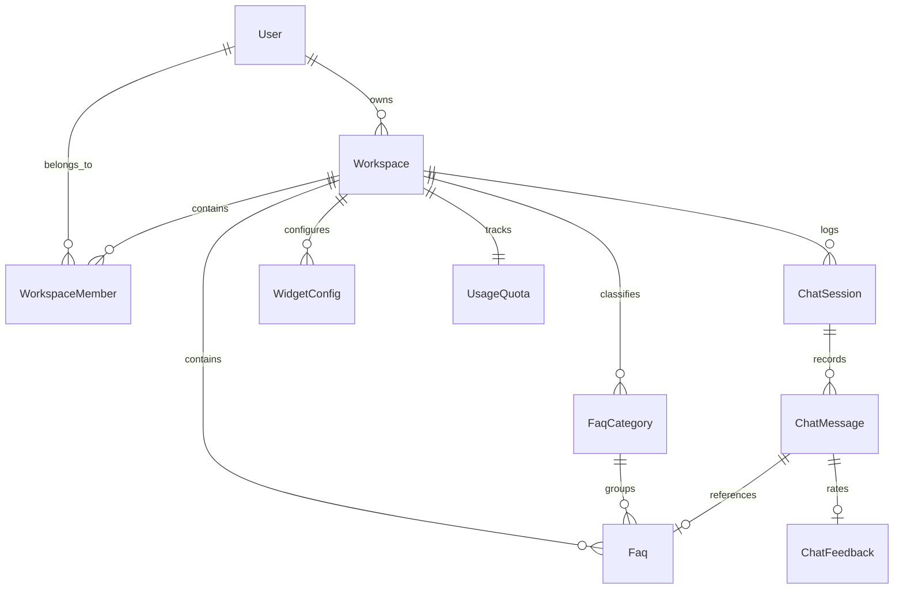

# FAQPilot AI: Database Schema & Entity Specification

This document details the relational entity-relationship design, tenant isolation architecture, index structures, and **Supabase (PostgreSQL)** database specifications for **FAQPilot AI**.

> [!TIP]
> For the complete copy-pasteable SQL migration script, see [001_initial_schema.sql](file:///c:/Users/l/OneDrive/Desktop/task%202/supabase/migrations/001_initial_schema.sql).  
> For the step-by-step setup walkthrough, see [docs/SUPABASE_SETUP.md](file:///c:/Users/l/OneDrive/Desktop/task%202/docs/SUPABASE_SETUP.md).

---

## 1. Entity-Relationship Model



---

## 2. Table Specifications

### 1. `User`
Stores authentication identities for business owners and staff.
- `id` (String, PK): Unique identifier (`usr_*`).
- `email` (String, Unique, Indexed): User login email.
- `passwordHash` (String): Secure bcrypt-hashed password (cost factor 10).
- `name` (String): Display name.
- `role` (Enum): `OWNER` | `ADMIN` | `MEMBER`.
- `createdAt` (ISO Timestamp).

### 2. `Workspace`
The core tenant isolation boundary.
- `id` (String, PK): Unique workspace UUID (`ws_*`).
- `name` (String): Business organization name.
- `slug` (String, Indexed): URL-safe organization slug.
- `description` (String): Company or product summary.
- `ownerId` (String, FK $\to$ User.id): Primary owner.
- `createdAt`, `updatedAt` (ISO Timestamp).

### 3. `FaqCategory`
Hierarchical classification for FAQs.
- `id` (String, PK): `cat_*`.
- `workspaceId` (String, FK $\to$ Workspace.id, Indexed): Tenant owner.
- `name` (String): Category title (e.g. "Billing", "Admissions").
- `color` (String): Hex accent color code (e.g. `#3B82F6`).

### 4. `Faq`
The ground-truth knowledge base items.
- `id` (String, PK): `faq_*`.
- `workspaceId` (String, FK $\to$ Workspace.id, Indexed): Tenant scope.
- `categoryId` (String, FK $\to$ FaqCategory.id, Nullable).
- `question` (Text): The representative user query.
- `answer` (Text): The verified official answer.
- `tags` (String Array): Keywords and synonym tags.
- `isEnabled` (Boolean, Default true): Visibility toggle.
- `viewCount` (Integer, Default 0): View counter for popularity ranking.
- `createdAt`, `updatedAt` (ISO Timestamp).

### 5. `ChatSession`
Tracks customer conversation sessions.
- `id` (String, PK): `sess_*`.
- `workspaceId` (String, FK $\to$ Workspace.id, Indexed).
- `channel` (Enum): `DASHBOARD` | `WIDGET` | `TEST`.
- `visitorId` (String, Nullable): Anonymous browser fingerprint.
- `createdAt`, `updatedAt` (ISO Timestamp).

### 6. `ChatMessage`
Individual dialogue turns between customer and assistant.
- `id` (String, PK): `msg_*`.
- `sessionId` (String, FK $\to$ ChatSession.id, Indexed).
- `workspaceId` (String, FK $\to$ Workspace.id, Indexed).
- `role` (Enum): `USER` | `ASSISTANT`.
- `content` (Text): Message string.
- `matchedFaqId` (String, Nullable, FK $\to$ Faq.id): Linked FAQ if matched.
- `similarityScore` (Float, Nullable): Calculated confidence score ($0.0 - 1.0$).
- `isFallback` (Boolean): True if confidence fell below threshold.
- `latencyMs` (Integer): Total computation time in milliseconds.

### 7. `ChatFeedback`
Visitor ratings on assistant answers.
- `id` (String, PK): `fb_*`.
- `messageId` (String, FK $\to$ ChatMessage.id, Unique).
- `workspaceId` (String, FK $\to$ Workspace.id, Indexed).
- `rating` (Enum): `HELPFUL` | `UNHELPFUL`.
- `comment` (Text, Nullable).

### 8. `WidgetConfig`
Public branding and embed settings.
- `id` (String, PK): `wc_*`.
- `workspaceId` (String, FK $\to$ Workspace.id, Unique).
- `publicId` (String, Unique, Indexed): Safe public key for `<script>` tag.
- `botName` (String): Assistant name displayed in header.
- `welcomeMessage` (Text): Initial greeting prompt.
- `primaryColor` (String): Hex brand color.
- `suggestedQuestions` (String Array): Starter prompt chips.
- `allowedDomains` (String Array): Allowed origin hostnames for CORS.

### 9. `UsageQuota`
Enforces tier conversation limits.
- `id` (String, PK): `uq_*`.
- `workspaceId` (String, FK $\to$ Workspace.id, Unique).
- `planTier` (Enum): `FREE` (500) | `STARTER` (5,000) | `BUSINESS` (25,000).
- `monthlyLimit` (Integer).
- `currentUsage` (Integer).
- `billingCycleStart` (ISO Timestamp).

---

## 3. Data Isolation Guarantee

To guarantee strict multi-tenancy:
1. No raw SQL or query is ever executed without a `workspaceId` filter.
2. Cross-tenant reads are prevented by validating user ownership in `verifyWorkspaceAccess`.
3. In production with PostgreSQL, Row-Level Security (RLS) policies can enforce:
   ```sql
   CREATE POLICY tenant_isolation_policy ON faqs
   USING (workspace_id = current_setting('app.current_workspace_id')::uuid);
   ```
